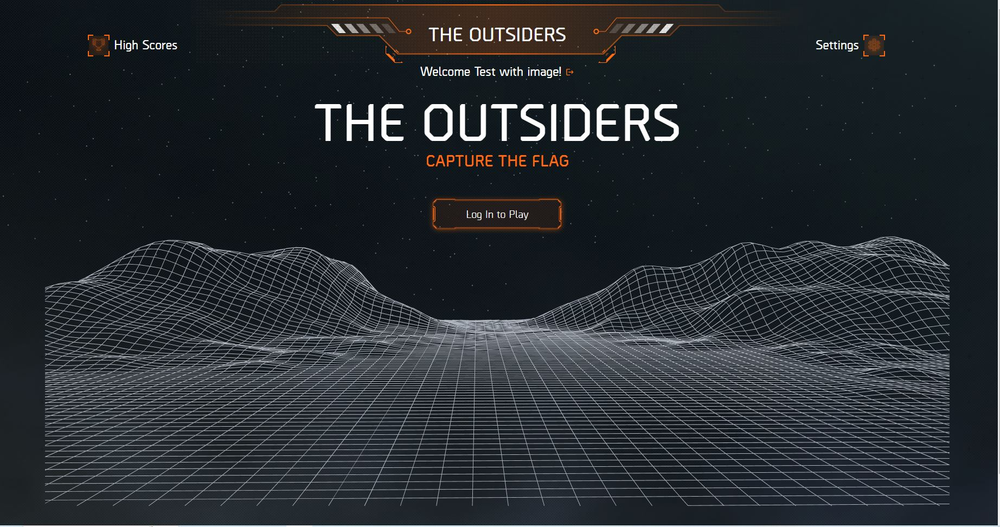
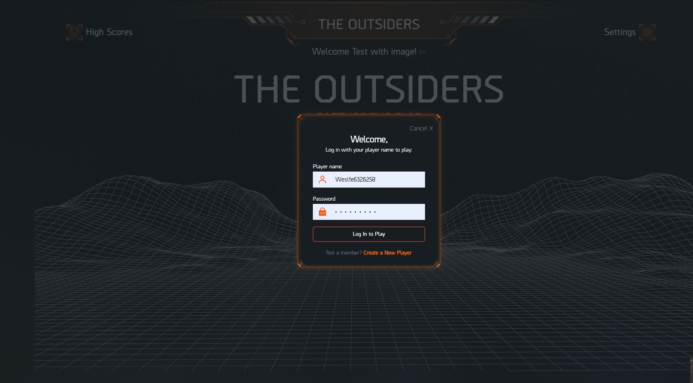
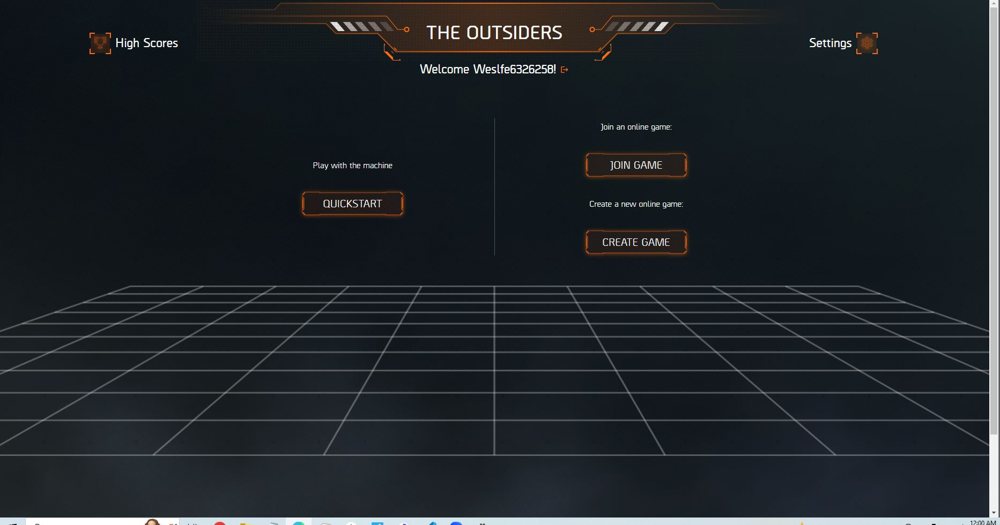
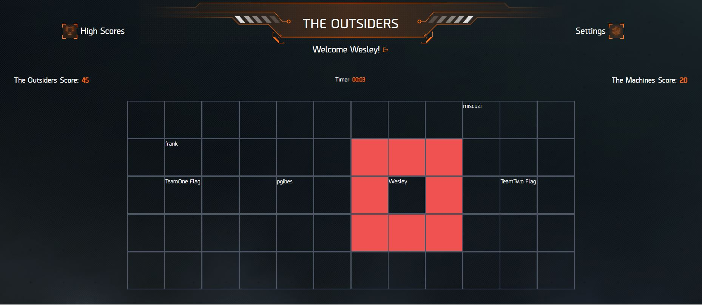

# Capture The Flag Game

A game of Capture the Flag can be a quick and simple turnaround or a long battle. Everything depends on the deviousness of the players. That, plus the number of teams and players , will determine the length and competitiveness of a game. You can play with any number of players but usually having at least 4 or more on a side is ideal.

The rules of Capture the Flag are simple. Each team tries to take the other team's flag and get it back to their territory. The game ends when one team gets the other flag to their home base. Learn more about how to play Capture the Flag.

## Table of Contents

- [Live Site](#live-site)
- [Screenshots](#screenshots)
- [Tech Used](#tech-used)
- [Installation](#installation)
- [Contribution](#contribution)
- [Questions](#questions)

### Live Site

[Capture the Flag](https://outsiders.herokuapp.com/)

### Screenshots

### Tech Used

- React for the front end.

- GraphQL with a Node.js and Express.js server.

- MongoDB and the Mongoose ODM for the database.

- Queries and mutations for retrieving, adding, updating, and deleting data.

- Project has been deployed using Heroku (with data).

- For styling we have used Tailwind

## Installation

- To use this app npm init has to be called to create your package.json file.
- The following necessary Npm dependencies must be installed to run the application properly: the needed dependencies will be found on the package.json file.
- To properly install the database you must create at cluster on Mongodb atlas.
- Run "npm start" for the port to start listening with mongoose.
- This app is deployed on Heroku

## Usage

HAVE FUN JUST PLAY

## Contribution

- Paul Gibes: https://github.com/PaulGibes

- Alex Sorbala: https://github.com/alex-sorbala

- Francisco J Gutierrez Rodarte: https://github.com/FranciscoGtzRodarte

- Wesley Palov: https://github.com/WesleyPalov

- Thomas Wray: https://github.com/Twray95
